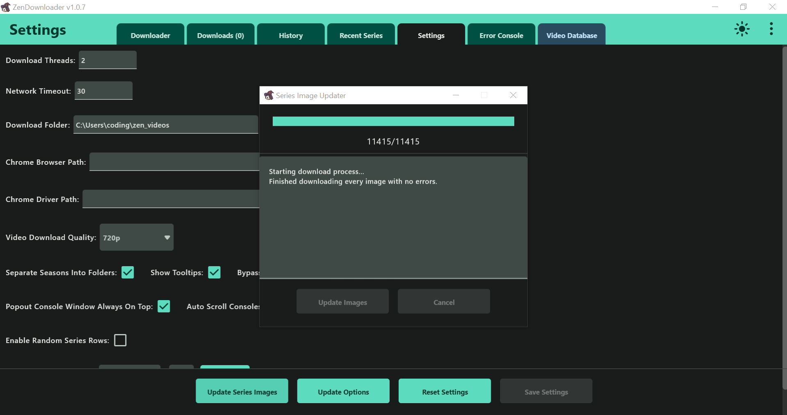
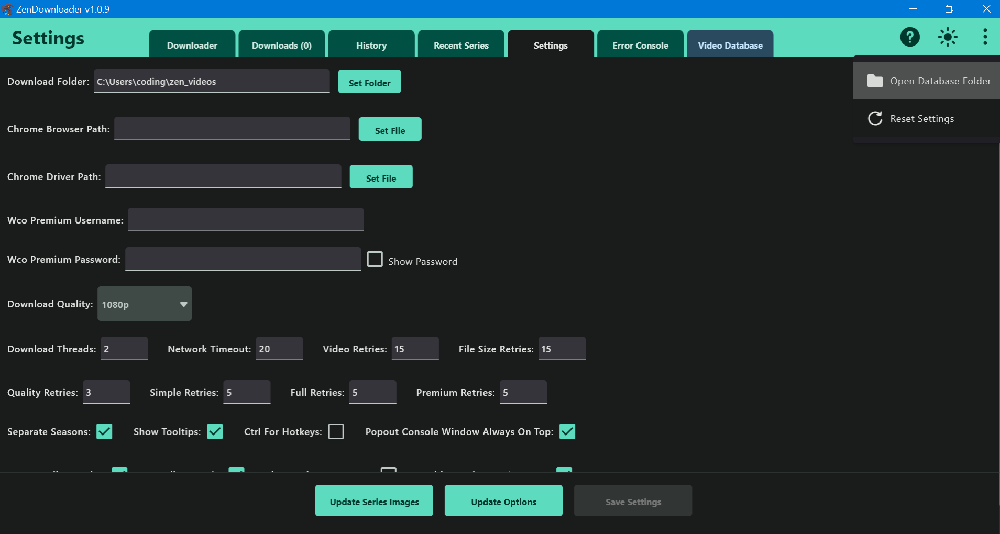

# Auto Download

There is now an auto asset downloader whenever you launch the app.
This downloader will download all the series files and the links file.

However the series images won't auto download at launch. You will still need to download them all if you want a smooth experience.

[Download Images](https://github.com/NobilityDeviant/ZenDownloader/tree/master/database#series-images)

# Disable Asset Updating

There's now options to disable certain assets from auto downloading at the start of the app.

Just go to Settings by pressing the Settings tab, pressing the Update Option button on the bottom and disable any option related to your asset.

All assets will download for the first launch, but won't for the other launches.

# Database

# Series

These are all the series database archives.

You can create your own by downloading series, but if you want to use the new Database WIndow then you will need to download these.

They are all split by their types: Dubbed, Subbed, Movies and Cartoon.

Each of these archives must be unzipped inside the database series folder which is inside your User folder.

Example of path: `C:\Users\CuratedDev\.zen_database\series\dubbed\`

# Download Series (Last Updated: 2/13/2025)

**Dubbed:** [dubbed.zip](https://github.com/NobilityDeviant/ZenDownloader/raw/master/database/dubbed.zip)

**Subbed:** [subbed.zip](https://github.com/NobilityDeviant/ZenDownloader/raw/master/database/subbed.zip)

**Movies:** [movies.zip](https://github.com/NobilityDeviant/ZenDownloader/raw/master/database/movies.zip)

**Cartoon:** [cartoon.zip](https://github.com/NobilityDeviant/ZenDownloader/raw/master/database/cartoon.zip)

Note: The movies database is unfinished and some entries might be completely incorrect.

I updated what I could for the movies. A lot of them didn't have any info or just are named incorrectly.

I have added an "Edit Movie" option inside the Database Window if you wish to help complete the database.

# Wco Data

The files **links.zip** and **data.zip** are in a different folder.

They are still database files and work the same way as series do.

If the **wco** folder doesn't exist then you must create it first.

# Download WCO Data (Last Updated: 8/23/2024)

Example of path: `C:\Users\CuratedDev\.zen_database\wco\links\`

**Links:** [links.zip](https://github.com/NobilityDeviant/ZenDownloader/raw/master/database/links.zip)

Example of path: `C:\Users\CuratedDev\.zen_database\wco\data\`

**Data:** [data.zip](https://github.com/NobilityDeviant/ZenDownloader/raw/master/database/data.zip)

The data is just the genres for now.

# Series Images

Most series have an image associated with them. In order to have a better experience when using the Database Window, it's advised that you also download the images.

# Series Image Updater

There's now an option to download the series images inside the Settings tab.

Click the `Update Series Images` button and click the `Update Images` button inside the window.

This will check every single image to see if it exists.
If it doesn't exist or it's incomplete, it will download each image 1 by 1.

# Manual Download

The `series_images` folder goes inside the database folder as well.

Example of path: `C:\Users\CuratedDev\.zen_database\series_images\`

# Download Series Images (Last Updated: 2/13/2025)

Series Images have been moved to a different repository.
When you download it, be sure to extract it and only move the `series_images` folder.

[Download Images (300MB)](https://github.com/NobilityDeviant/ZenDownloaderSeriesImages/archive/refs/heads/main.zip)

-------------------------------------------------------------------------------------

You can also access the database folder with this button inside the Settings page.
You will have to close the program in order to edit in database files.

Since the database folder starts with a `.` it will be hidden in Linux by default.

There will usually be a hamburger (menu) icon to show an option to view hidden files.
